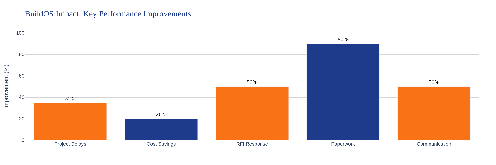
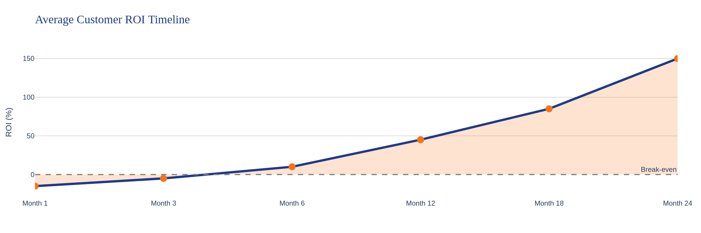
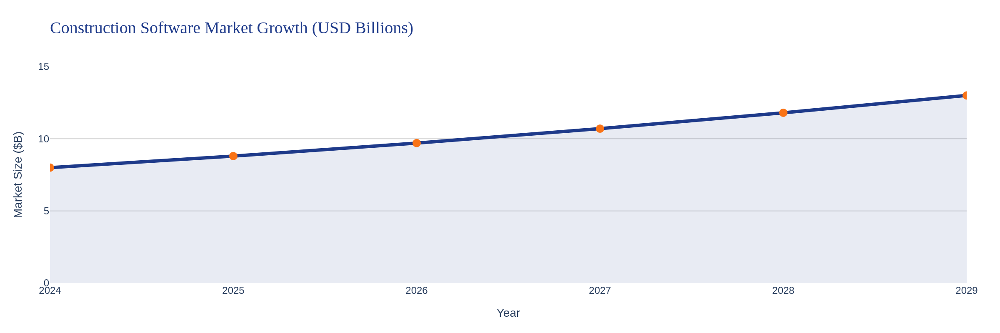
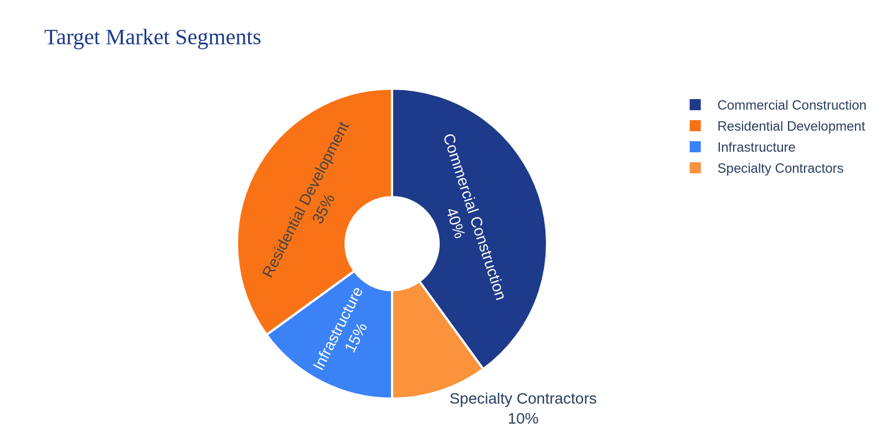

\begin{center}
\includegraphics[width=0.3\textwidth]{logo.jpg}

\vspace{1cm}

{\Huge \textcolor{buildosblue}{\textbf{BuildOS}}}

\vspace{0.5cm}

{\Large \textcolor{buildosorange}{\textbf{The Future of Construction Project Management}}}

\vspace{0.3cm}

{\large AI-Powered Collaboration Platform}

\vspace{2cm}

{\large \textbf{White Paper for Investors \& Customers}}

\vspace{0.5cm}

{\normalsize January 2026}

\vspace{3cm}

\textit{Transforming Construction Management Through Innovation}

\end{center}

\newpage

\tableofcontents

\newpage

# Executive Summary {#executive-summary}

BuildOS represents the next generation of construction project management software, combining cutting-edge artificial intelligence with comprehensive workflow automation to deliver unprecedented efficiency gains for the construction industry. In an industry plagued by delays, cost overruns, and fragmented communication, BuildOS offers a unified, intelligent platform that transforms how construction projects are planned, executed, and delivered.

## The BuildOS Value Proposition

BuildOS is not just another project management tool—it's a complete digital transformation platform for construction firms. Our AI-powered system delivers measurable results:

- **35% reduction in project delays** through real-time collaboration and automated workflows
- **20% average cost savings** via intelligent change order management and financial analytics
- **50% faster RFI response times** with automated routing and notifications
- **90% reduction in manual paperwork** through digital workflows and document control

## Target Market & Opportunity

BuildOS serves the entire construction ecosystem, from commercial construction firms and residential developers to general contractors and specialty subcontractors. With the construction software market valued at $12 billion and growing at 10% annually, BuildOS is positioned to capture significant market share by addressing the critical pain points that plague the industry.

Our platform is designed for organizations of all sizes, from small regional contractors managing individual projects to large enterprise firms and institutional developers coordinating billions in capital deployment. The project-based pricing model ($2,400-$12,000 per project per year) aligns with how construction firms budget and allows costs to be passed through to project owners, while portfolio licensing ($25k-$150k annually) serves developers managing multiple assets.

## Competitive Edge & Innovation

What sets BuildOS apart is our integrated approach to construction management. While competitors offer point solutions for specific workflows, BuildOS provides:

1. **Unified Platform Architecture**: All construction workflows—from RFIs and submittals to change orders and daily reports—operate within a single, cohesive system with 77 routes and 53 API endpoints.

2. **AI-Powered Design Services**: Unique integration with external AI design platforms enables automated architectural rendering, design task generation, and intelligent workflow routing—capabilities not found in traditional construction management software.

3. **Real-Time Financial Analytics**: Comprehensive property profiling, capital stack management, multi-year cash flow projections, and IRR/NPV calculations provide executives with unprecedented financial visibility.

4. **Intelligent Automation**: n8n webhook integrations and automated workflows eliminate manual data entry and accelerate approval processes, freeing teams to focus on high-value activities.

5. **Modern Technology Stack**: Built on Next.js 14, TypeScript, and Prisma ORM with cloud-native architecture, BuildOS delivers enterprise-grade performance, security, and scalability that legacy systems cannot match.

BuildOS is more than software—it's a strategic advantage that enables construction firms to win more bids, deliver projects faster, and maximize profitability in an increasingly competitive market.

\newpage

# Industry Challenge {#industry-challenge}

The construction industry stands at a critical crossroads. Despite being a $1.6 trillion market in the United States alone, construction remains one of the least digitized sectors of the economy. This digital divide has created systemic inefficiencies that cost the industry billions of dollars annually and prevent firms from achieving their full potential.

## The Scale of the Problem

Construction projects are notoriously difficult to deliver on time and on budget. Industry research reveals alarming statistics:

- **80% of construction projects exceed their original budget**, with cost overruns averaging 20-30% of the initial estimate
- **Average project delays of 20%** translate to months of lost time, increased carrying costs, and damaged client relationships
- **30% of construction time** is spent on non-productive activities, including searching for project information, waiting for approvals, and reworking errors
- **$177 billion annually** is lost due to poor communication and data management across the construction lifecycle

These challenges are not isolated incidents—they represent fundamental structural problems in how the industry operates.

## Root Causes of Construction Inefficiency

### Fragmented Communication Tools

Construction teams typically juggle 5-10 different software applications, spreadsheets, and communication platforms. Project managers use one tool for scheduling, another for budgeting, a third for RFIs, and rely on email for general communication. This fragmentation creates information silos where critical data is scattered across systems, making it nearly impossible to maintain a single source of truth.

Field teams often work with outdated information because updates made in the office don't reach them in real-time. Subcontractors operate in their own systems, creating coordination challenges. The result is miscommunication, duplicated effort, and costly mistakes that could have been prevented with better information flow.

### Manual Processes and Paperwork

Despite advances in technology, construction remains heavily dependent on manual processes. Daily reports are handwritten in the field and transcribed later. RFIs are drafted in Word documents, emailed for review, and tracked in spreadsheets. Change orders require multiple signatures and physical routing through the organization.

This reliance on manual processes creates multiple problems: data entry errors, lost documents, approval bottlenecks, and the inability to analyze trends or generate insights from historical data. Teams spend valuable time on administrative tasks rather than productive construction activities.

### Lack of Real-Time Visibility

Construction executives and project managers often lack real-time visibility into project status, financial performance, and emerging risks. Traditional reporting relies on weekly or monthly updates that are outdated by the time they're reviewed. By the time problems are identified, they've often escalated into major issues requiring expensive corrective action.

Without real-time dashboards and analytics, decision-makers operate with incomplete information. They can't quickly identify which projects are at risk, where resources should be reallocated, or how current performance compares to historical benchmarks. This information gap leads to reactive rather than proactive management.

### Poor Financial Tracking and Change Order Management

Change orders are a fact of life in construction, but managing them effectively remains a major challenge. Many firms struggle to track change order requests, assess their financial impact, and process approvals in a timely manner. The result is scope creep, budget overruns, and disputes with clients and subcontractors.

Financial tracking is often disconnected from project operations. Accounting systems don't integrate with project management tools, making it difficult to understand real-time profitability, forecast cash flow needs, or identify cost-saving opportunities. By the time financial reports are generated, it's too late to course-correct.

## The Cost of Inaction

For construction firms that continue operating with legacy systems and manual processes, the competitive disadvantage grows larger each year. Firms that embrace digital transformation are winning more bids, delivering projects faster, and achieving higher profit margins. Those that don't risk being left behind in an increasingly competitive market where clients demand transparency, efficiency, and predictable outcomes.

The industry needs a comprehensive solution that addresses these challenges holistically—not another point solution that solves one problem while leaving others unaddressed. BuildOS was designed specifically to meet this need.

\newpage

# The BuildOS Solution {#buildos-solution}

BuildOS reimagines construction project management from the ground up, delivering a unified platform that connects every stakeholder, workflow, and data point across the construction lifecycle. Rather than forcing teams to adapt to rigid software, BuildOS adapts to how construction teams actually work, eliminating friction and accelerating productivity.

## A Unified Platform for All Construction Workflows

At its core, BuildOS provides a single, integrated environment where all project information lives and all workflows execute. Teams no longer need to switch between applications, search through email threads, or reconcile data across systems. Everything they need is accessible from one intuitive interface, whether they're in the office, in the field, or meeting with clients.

This unified approach delivers immediate benefits: faster onboarding for new team members, reduced software licensing costs, elimination of data synchronization issues, and the ability to generate comprehensive insights from integrated data.

## Core Modules Overview

BuildOS encompasses 11 comprehensive modules that cover every aspect of construction project management:

### Project Management & Tracking

The foundation of BuildOS is robust project management functionality that provides complete visibility into project status, schedules, budgets, and team activities. Project managers can create detailed project profiles, assign team members with role-based permissions, track milestones and deliverables, and monitor progress against baseline plans.

Real-time dashboards provide at-a-glance status updates, highlighting projects that need attention and surfacing potential risks before they become problems. Customizable views allow each team member to see the information most relevant to their role, from high-level portfolio summaries for executives to detailed task lists for field workers.

### RFIs (Request for Information) Management

RFIs are critical for resolving ambiguities and obtaining clarifications during construction. BuildOS streamlines the entire RFI lifecycle with automated workflows that route requests to the appropriate parties, track response times, and maintain a complete audit trail.

The system automatically notifies stakeholders when RFIs are submitted, reviewed, or answered, ensuring nothing falls through the cracks. Advanced search and filtering capabilities make it easy to find relevant RFIs from current or past projects, reducing duplicated effort and accelerating resolution times.

### Submittals & Document Control

Managing submittals—shop drawings, product data, samples, and other documents requiring approval—is simplified with BuildOS's comprehensive document control system. Teams can upload documents, route them through multi-stage approval workflows, track revisions, and maintain version control automatically.

Integration with AWS S3 provides secure, scalable document storage with fast access from anywhere. Automated notifications keep approval processes moving, while detailed logs provide complete traceability for compliance and audit purposes.

### Change Order Automation

BuildOS transforms change order management from a manual, time-consuming process into an automated workflow that accelerates approvals and provides real-time financial visibility. Teams can create change order requests directly from RFIs or field observations, automatically calculating cost and schedule impacts.

The system routes change orders through configurable approval chains, tracks status in real-time, and updates project budgets automatically upon approval. Integration with n8n webhooks enables advanced automation scenarios, such as triggering external workflows or notifying accounting systems.

### Daily Reports & Field Data

Field teams can quickly capture daily activities, weather conditions, workforce counts, equipment usage, and progress photos using mobile-friendly forms. Daily reports are instantly available to project managers and executives, providing real-time visibility into field operations.

Historical daily reports become a valuable project record, useful for resolving disputes, analyzing productivity trends, and improving future estimates. The system can automatically generate summary reports and analytics from daily report data.

### Punch List Management

As projects near completion, BuildOS's punch list module helps teams systematically identify, track, and resolve outstanding items. Punch items can be assigned to specific trades, prioritized by severity, and tracked through resolution with photo documentation.

Automated reminders ensure punch items don't languish, while reporting capabilities provide clear visibility into completion status for owners and project managers.

### Time & Material Tracking

Accurate time and material tracking is essential for cost control and billing. BuildOS enables field workers to log time against specific projects and cost codes, while project managers can track material usage and equipment hours.

This data feeds directly into financial analytics, providing real-time labor and material cost visibility. For time-and-materials contracts, the system can automatically generate billing reports based on tracked time and materials.

### Equipment Management

Construction firms can track their equipment fleet, schedule maintenance, monitor utilization, and optimize allocation across projects. The equipment module maintains complete equipment profiles including specifications, maintenance history, and current location.

Automated maintenance reminders help prevent breakdowns, while utilization analytics identify underutilized assets that could be redeployed or sold.

### Financial Analytics & ROI Calculator

BuildOS provides comprehensive financial analytics that give executives unprecedented visibility into project profitability, cash flow, and portfolio performance. The platform includes:

- Real-time budget vs. actual tracking with variance analysis
- Multi-year cash flow projections with IRR and NPV calculations
- Capital stack management for development projects
- Property profiling with detailed financial modeling
- Change order financial impact analysis
- Portfolio-level financial dashboards

The built-in ROI calculator helps firms quantify the value of BuildOS by tracking efficiency gains, cost savings, and productivity improvements.

### AI-Powered Design Services Integration

BuildOS's unique integration with external AI design platforms enables automated architectural rendering and design task generation. When design work is needed, the system can automatically create design requests, route them to AI design services, and receive completed work through callback webhooks.

This integration accelerates design iterations, reduces costs, and enables construction firms to offer enhanced design services to clients without maintaining large in-house design teams.

### Real-time Notifications & Activity Tracking

Every action in BuildOS generates activity logs and can trigger notifications to relevant stakeholders. Teams stay informed about RFI responses, submittal approvals, change order status, and other critical events without constantly checking the system.

Configurable notification preferences ensure team members receive important updates without being overwhelmed by noise. The activity feed provides a complete audit trail for compliance and dispute resolution.

## Key Differentiators

What truly sets BuildOS apart from competitors is the combination of comprehensive functionality, modern technology, and intelligent automation:

- **AI Integration**: Unique AI-powered design services and intelligent workflow automation capabilities not found in traditional construction software
- **Automated Workflows**: n8n webhook integrations and configurable automation eliminate manual processes and accelerate approvals
- **Real-Time Collaboration**: Instant updates, notifications, and activity tracking keep distributed teams synchronized
- **Financial Intelligence**: Advanced financial analytics and modeling capabilities typically found only in specialized real estate software
- **Modern Architecture**: Cloud-native design with 77 routes, 53 API endpoints, and mobile-responsive interface built on cutting-edge technology
- **Extensibility**: RESTful API architecture enables integration with existing systems and third-party tools

BuildOS is not just a tool—it's a complete digital transformation platform that enables construction firms to operate at a level of efficiency and sophistication previously unattainable.

\newpage

# AI-Powered Innovation {#ai-innovation}

Artificial intelligence is not a buzzword at BuildOS—it's a fundamental component of how the platform delivers value. While many construction software vendors are just beginning to explore AI capabilities, BuildOS has integrated AI deeply into its core workflows, providing tangible benefits that directly impact project outcomes.

## Integrated AI Design Services

BuildOS's most distinctive AI capability is its integration with external AI design platforms for architectural rendering and design task automation. This integration transforms how construction firms handle design work:

When a project requires architectural renderings, design modifications, or visualization work, users can create design requests directly within BuildOS. The system automatically generates structured design tasks with detailed specifications, project context, and reference materials. These tasks are routed to AI design platforms via secure webhook integrations, where advanced AI models process the requests.

The AI design platform performs tasks such as:
- Generating photorealistic architectural renderings from sketches or descriptions
- Creating multiple design variations for client review
- Producing 3D visualizations of proposed modifications
- Rendering different material and finish options
- Generating site plan visualizations

Once the AI completes the design work, results are automatically posted back to BuildOS through callback webhooks. The completed designs are attached to the original request, notifications are sent to relevant stakeholders, and the work is ready for review—all without manual intervention.

This integration provides several advantages:
- **Speed**: AI-generated designs are available in hours rather than days or weeks
- **Cost**: Significantly lower cost than traditional design services for routine visualization work
- **Iteration**: Easy to generate multiple variations and explore design options
- **Accessibility**: Smaller firms can offer design services without maintaining large design teams
- **Integration**: Design work is seamlessly connected to project workflows and documentation

## Automated Task Generation and Workflow Routing

BuildOS uses intelligent automation to eliminate manual workflow management. When certain events occur—such as an RFI being submitted, a change order being approved, or a submittal requiring review—the system automatically:

- Identifies the appropriate stakeholders based on project roles and responsibilities
- Routes tasks to the right people with appropriate priority levels
- Generates notifications through preferred channels (email, in-app, mobile push)
- Escalates items that haven't been addressed within defined timeframes
- Updates related records and dashboards in real-time

This intelligent routing ensures that work flows smoothly through the organization without project managers manually tracking and assigning every task. The system learns from historical patterns to optimize routing decisions over time.

## Intelligent Analytics and Predictive Insights

BuildOS analyzes project data to surface insights that would be difficult or impossible to identify manually:

- **Risk Detection**: Identifies projects showing early warning signs of delays or cost overruns based on patterns in historical data
- **Resource Optimization**: Analyzes equipment utilization and workforce allocation to recommend optimal resource deployment
- **Trend Analysis**: Identifies recurring issues across projects (frequent RFIs on certain topics, common change order causes) to inform process improvements
- **Performance Benchmarking**: Compares current project performance against historical benchmarks and industry standards
- **Forecasting**: Predicts project completion dates and final costs based on current trajectory and historical patterns

These insights are presented through intuitive dashboards and automated reports, enabling data-driven decision-making at all levels of the organization.

## Natural Language Processing for Document Analysis

BuildOS incorporates natural language processing capabilities to extract value from unstructured project documents:

- Automatically categorizes and tags uploaded documents based on content
- Extracts key information from contracts, specifications, and correspondence
- Identifies potential conflicts or ambiguities in project documentation
- Enables semantic search across all project documents
- Generates summaries of lengthy documents for quick review

This capability transforms document management from a filing exercise into an intelligent knowledge base that actively supports project teams.

## Smart Notifications and Priority Management

Not all notifications are equally important, and BuildOS uses intelligent algorithms to prioritize information delivery:

- Learns from user behavior to understand which notifications are most important to each individual
- Adjusts notification frequency and channels based on urgency and user preferences
- Groups related notifications to reduce noise while ensuring critical items are highlighted
- Provides smart digests that summarize activity during off-hours for review the next day
- Identifies items requiring immediate attention and escalates appropriately

This intelligent approach ensures teams stay informed without being overwhelmed, improving response times for critical issues while reducing notification fatigue.

## The AI Advantage

BuildOS's AI capabilities provide a significant competitive advantage for construction firms. Projects move faster because routine tasks are automated and design work is accelerated. Costs are lower because AI handles work that would otherwise require manual effort or expensive external services. Quality improves because AI-powered analytics identify issues early when they're easier and cheaper to address.

As AI technology continues to advance, BuildOS is positioned to incorporate new capabilities rapidly, ensuring customers always have access to the latest innovations in construction technology.

\newpage

# Technology Architecture {#technology-architecture}

BuildOS is built on a modern, cloud-native technology stack that delivers enterprise-grade performance, security, and scalability. Every architectural decision was made with the specific needs of construction firms in mind, balancing power and flexibility with ease of use and reliability.

## Modern Tech Stack

### Next.js 14 Framework

BuildOS is built on Next.js 14, the latest version of the industry-leading React framework. Next.js provides several critical advantages:

- **Server-Side Rendering (SSR)**: Pages load quickly with content rendered on the server, improving performance and SEO
- **API Routes**: Built-in API functionality enables clean separation between frontend and backend logic
- **File-Based Routing**: Intuitive routing system makes the application easy to navigate and maintain
- **Automatic Code Splitting**: Only the code needed for each page is loaded, optimizing performance
- **Built-in Optimization**: Automatic image optimization, font optimization, and other performance enhancements

The framework's maturity and extensive ecosystem ensure BuildOS can evolve rapidly while maintaining stability.

### TypeScript for Type Safety

The entire codebase is written in TypeScript, providing compile-time type checking that catches errors before they reach production. TypeScript's strong typing improves code quality, makes refactoring safer, and provides excellent developer experience with intelligent code completion and inline documentation.

For a complex application like BuildOS with 77 routes and 53 API endpoints, TypeScript's type safety is essential for maintaining code quality as the platform grows.

### Prisma ORM for Database Management

Prisma provides a modern, type-safe database layer that makes working with data intuitive and error-free. Key benefits include:

- **Type-Safe Queries**: Database queries are type-checked at compile time, preventing runtime errors
- **Automatic Migrations**: Database schema changes are managed through version-controlled migration files
- **Intuitive API**: Clean, readable syntax makes database operations straightforward
- **Performance**: Optimized query generation and connection pooling ensure fast data access
- **Multi-Database Support**: Can work with PostgreSQL, MySQL, SQL Server, and other databases

BuildOS's comprehensive data model—including Projects, RFIs, Submittals, Change Orders, Daily Reports, Documents, Punch Items, Time Tracking, Equipment, Properties, and Design Requests—is managed entirely through Prisma.

## Cloud-Native Architecture

### AWS S3 Integration

All project documents, photos, and files are stored in Amazon S3, providing:

- **Scalability**: Unlimited storage capacity that grows with your needs
- **Reliability**: 99.999999999% durability ensures documents are never lost
- **Performance**: Fast access to files from anywhere in the world
- **Security**: Encryption at rest and in transit protects sensitive project data
- **Cost-Effectiveness**: Pay only for storage actually used

S3 integration is seamless—users simply upload files through the BuildOS interface, and the system handles all storage, retrieval, and security automatically.

### Scalable PostgreSQL Database

BuildOS uses PostgreSQL, the world's most advanced open-source relational database. PostgreSQL provides:

- **ACID Compliance**: Transactions are reliable and data integrity is guaranteed
- **Advanced Features**: Support for JSON data, full-text search, and complex queries
- **Scalability**: Can handle databases from gigabytes to terabytes
- **Extensibility**: Custom functions and data types enable advanced functionality
- **Performance**: Sophisticated query optimization delivers fast response times

The database can be deployed on managed services like AWS RDS or Azure Database for PostgreSQL, providing automatic backups, high availability, and easy scaling.

## Enterprise-Grade Security

### NextAuth.js Authentication

BuildOS uses NextAuth.js for authentication, providing:

- **Multiple Authentication Methods**: Support for email/password, OAuth providers, and SSO
- **Session Management**: Secure session handling with automatic token refresh
- **CSRF Protection**: Built-in protection against cross-site request forgery attacks
- **Secure Cookies**: HTTP-only, secure cookies prevent token theft
- **Extensibility**: Easy to add custom authentication providers

### Role-Based Access Control

BuildOS implements comprehensive role-based access control (RBAC) with five distinct roles:

- **Admin**: Full system access, user management, and configuration
- **Project Manager**: Project creation, team management, and approval authority
- **Field Worker**: Daily reports, time tracking, and field data entry
- **Architect**: Design services, submittals, and document review
- **Executive**: Financial analytics, portfolio dashboards, and high-level reporting

Each role has precisely defined permissions, ensuring users can access the information they need while protecting sensitive data.

### Data Security

Multiple layers of security protect project data:

- **HTTPS Encryption**: All data in transit is encrypted using TLS 1.3
- **Database Encryption**: Data at rest is encrypted in the database
- **S3 Encryption**: Documents are encrypted in S3 storage
- **Audit Trails**: Complete activity logging for compliance and security monitoring
- **Regular Backups**: Automated backups with point-in-time recovery
- **Access Logging**: All data access is logged for security analysis

## RESTful API Architecture

BuildOS exposes 53 RESTful API endpoints that enable:

- **Third-Party Integrations**: Connect BuildOS with accounting systems, ERP platforms, and other tools
- **Custom Applications**: Build custom interfaces or mobile apps on top of BuildOS data
- **Automation**: Trigger BuildOS actions from external systems
- **Data Export**: Extract data for analysis in external tools
- **Webhook Callbacks**: Receive real-time notifications of BuildOS events

The API follows REST best practices with consistent endpoint naming, proper HTTP methods, comprehensive error handling, and detailed documentation.

## Real-Time Webhook Integrations

BuildOS integrates with n8n, a powerful workflow automation platform, enabling sophisticated automation scenarios:

- **Change Order Automation**: Automatically route change orders through external approval systems
- **Design Services Integration**: Send design requests to AI platforms and receive results automatically
- **Accounting Integration**: Sync financial data with QuickBooks, Xero, or other accounting systems
- **Notification Routing**: Send notifications through Slack, Microsoft Teams, or SMS
- **Custom Workflows**: Build any automation scenario your organization needs

Webhooks are secured with secret tokens and support both outbound (BuildOS triggering external systems) and inbound (external systems updating BuildOS) scenarios.

## Mobile-Responsive Design with Radix UI

The user interface is built with Radix UI, a modern component library that provides:

- **Accessibility**: WCAG-compliant components ensure the platform is usable by everyone
- **Consistency**: Uniform design language across all pages and features
- **Responsiveness**: Automatically adapts to desktop, tablet, and mobile screens
- **Customization**: Easily themed to match your organization's branding
- **Performance**: Lightweight components that load quickly

Field workers can use BuildOS effectively on smartphones and tablets, while office staff benefit from rich desktop interfaces.

## Deployment and Scalability

BuildOS can be deployed in multiple configurations:

- **Cloud-Hosted SaaS**: Fully managed deployment with automatic updates and scaling
- **On-Premise**: Deploy on your own infrastructure for maximum control
- **Hybrid**: Combine cloud and on-premise components to meet specific requirements

The architecture scales horizontally, allowing additional servers to be added as usage grows. Database read replicas can be deployed for improved performance, and CDN integration ensures fast page loads worldwide.

With 77 active routes serving all construction workflows, BuildOS provides a comprehensive, performant, and secure platform that construction firms can rely on for their most critical operations.

\newpage

# Key Features & Benefits {#features-benefits}

BuildOS delivers value to every role in the construction organization, from field workers capturing daily activities to executives analyzing portfolio performance. The platform's comprehensive feature set addresses the specific needs of each stakeholder while maintaining the unified data model that makes cross-functional collaboration seamless.

## For Project Managers

Project managers are the linchpin of construction success, and BuildOS provides them with the tools they need to keep projects on track, on budget, and moving forward.

### Real-Time Dashboards

Project managers access customizable dashboards that provide at-a-glance visibility into all their projects. Key metrics—budget status, schedule progress, open RFIs, pending submittals, outstanding change orders—are immediately visible. Color-coded indicators highlight projects requiring attention, enabling proactive management rather than reactive firefighting.

Drill-down capabilities allow project managers to investigate issues quickly. A single click on a budget variance opens detailed cost breakdowns. Clicking on overdue RFIs shows exactly which items need follow-up and who is responsible.

### Automated Reporting

Weekly and monthly reports that once required hours of manual compilation are now generated automatically. BuildOS pulls data from all project activities—daily reports, time tracking, change orders, RFIs—and produces comprehensive status reports with charts, tables, and narrative summaries.

Project managers can customize report templates to match client requirements or internal standards, then schedule automatic generation and distribution. This automation frees up hours each week for higher-value activities.

### Instant Notifications

Project managers stay informed about critical events without constantly monitoring the system. When an RFI is submitted, a submittal is approved, or a change order requires review, notifications arrive instantly via email, in-app alerts, or mobile push notifications.

Smart filtering ensures project managers see what matters most. Routine updates are batched into daily digests, while urgent items trigger immediate alerts. The system learns from user behavior to optimize notification delivery over time.

### Collaboration Tools

BuildOS facilitates seamless collaboration with team members, subcontractors, and clients. Comments and discussions are attached directly to relevant items—RFIs, submittals, change orders—keeping all communication in context and easily searchable.

@mentions notify specific individuals when their input is needed. File attachments and photo annotations enable clear communication about complex issues. The complete conversation history is preserved for future reference and dispute resolution.

## For Field Teams

Field workers need tools that are fast, mobile-friendly, and don't interfere with productive work. BuildOS delivers exactly that.

### Mobile-Friendly Daily Reports

Field supervisors can complete daily reports in minutes using their smartphones or tablets. The mobile interface is optimized for quick data entry with large touch targets, dropdown menus for common entries, and voice-to-text support for narrative descriptions.

Photos captured on mobile devices are automatically attached to daily reports with GPS coordinates and timestamps. Weather conditions can be pulled automatically from local weather services. The system remembers common entries (crew members, equipment, activities) to speed up future reports.

### Time Tracking

Workers can clock in and out directly from their mobile devices, with time automatically allocated to the correct project and cost code. Supervisors can review and approve timecards on their phones, and corrections can be made easily if needed.

Integration with payroll systems means time data flows automatically to accounting, eliminating manual timecard transcription and reducing payroll processing time.

### Equipment Management

Field teams can check equipment in and out, report maintenance issues, and view equipment specifications and operating instructions directly from their mobile devices. When equipment breaks down, maintenance requests are submitted instantly with photos and descriptions, accelerating repair response.

Equipment location tracking helps teams find the equipment they need quickly, reducing downtime and improving utilization.

### Offline Capability

Construction sites don't always have reliable internet connectivity. BuildOS's mobile interface works offline, allowing field teams to enter data even without network access. When connectivity is restored, data syncs automatically to the cloud, ensuring nothing is lost.

## For Executives

Executives need high-level visibility into portfolio performance, financial health, and strategic metrics. BuildOS provides executive dashboards that deliver exactly this information.

### Financial Analytics

Comprehensive financial dashboards show portfolio-level profitability, cash flow projections, and budget performance across all projects. Executives can quickly identify which projects are performing well and which need attention.

Trend analysis shows how current performance compares to historical benchmarks and industry standards. Forecasting capabilities project future financial performance based on current trajectory, enabling proactive resource allocation and strategic planning.

### ROI Calculator

The built-in ROI calculator helps executives quantify the value BuildOS delivers to the organization. The system tracks efficiency gains (time saved on reporting, faster RFI response, reduced rework), cost savings (lower software licensing, reduced administrative overhead), and productivity improvements (more projects managed per PM, faster project completion).

These metrics are presented in financial terms—dollars saved, revenue enabled, profit margin improvement—making it easy to justify continued investment in the platform and demonstrate value to stakeholders.

### Portfolio Insights

Executive dashboards provide portfolio-level views that aggregate data across all projects. Executives can see total backlog, pipeline value, resource utilization, and capacity constraints at a glance.

Comparative analytics show which project types, clients, or regions are most profitable. This intelligence informs strategic decisions about where to focus business development efforts and which market segments to prioritize.

### Budget Tracking

Real-time budget tracking shows exactly where each project stands financially. Executives can drill down from portfolio-level summaries to individual project budgets to line-item details, understanding precisely where money is being spent and where variances are occurring.

Automated alerts notify executives when projects exceed budget thresholds, enabling early intervention before small overruns become major problems.

## For Architects and Engineers

Design professionals need tools that support their technical workflows while integrating with project management processes.

### AI Design Services

Architects can leverage BuildOS's integrated AI design services to accelerate rendering and visualization work. Design requests created in BuildOS are automatically routed to AI platforms, with completed work returned directly to the project file.

This integration is particularly valuable for routine visualization work—rendering material options, generating site plan views, creating marketing visualizations—freeing architects to focus on complex design challenges that require human creativity and judgment.

### Submittal Workflows

The submittal module streamlines the review and approval process for shop drawings, product data, and samples. Architects can review submittals directly in BuildOS, mark up documents with comments and annotations, and route items through multi-stage approval workflows.

Version control ensures everyone is working with the latest approved documents. Automated notifications keep the submittal process moving, reducing delays caused by items sitting in review queues.

### Document Control

Comprehensive document management provides architects with organized access to all project documentation—drawings, specifications, contracts, correspondence. Advanced search capabilities make it easy to find specific information quickly.

Document relationships (superseded versions, related RFIs, associated change orders) are tracked automatically, providing complete context for every document.

## Feature Highlight: Measurable Impact

BuildOS delivers quantifiable improvements across key performance indicators:

- **35% Reduction in Project Delays**: Real-time collaboration, automated workflows, and proactive risk identification keep projects on schedule
- **20% Cost Savings**: Intelligent change order management, budget tracking, and resource optimization reduce project costs
- **50% Faster RFI Response**: Automated routing, instant notifications, and mobile access accelerate RFI resolution
- **90% Reduction in Manual Paperwork**: Digital workflows eliminate manual data entry and paper-based processes
- **Real-Time Visibility**: Dashboards and analytics provide instant insight into project status and performance

These improvements translate directly to bottom-line results: more projects delivered on time and on budget, higher client satisfaction, improved profit margins, and competitive advantage in winning new work.

\newpage

# Real Estate & Financial Analysis {#financial-analysis}

Construction firms increasingly need sophisticated financial analysis capabilities, particularly those involved in development projects or build-to-suit work. BuildOS includes comprehensive real estate financial analysis tools that rival specialized real estate software, providing construction firms with the analytical capabilities they need to evaluate opportunities, manage development projects, and maximize returns.

## Comprehensive Property Profiling

BuildOS enables detailed property profiling for development projects, capturing all relevant information in a structured format:

- **Property Details**: Location, size, zoning, land area, building area, and physical characteristics
- **Asset Classification**: Property type (office, retail, multifamily, industrial, mixed-use) and development stage (pre-development, under construction, stabilized, disposition)
- **Market Context**: Submarket analysis, comparable properties, market trends, and competitive positioning
- **Development Timeline**: Key milestones, entitlement status, construction schedule, and lease-up projections

This comprehensive profiling provides the foundation for detailed financial analysis and enables portfolio-level comparisons across multiple properties.

## Capital Stack Management

Development projects typically involve complex capital structures with multiple funding sources. BuildOS's capital stack module tracks:

- **Equity Layers**: Common equity, preferred equity, mezzanine financing with different return requirements and priority levels
- **Debt Instruments**: Senior debt, construction loans, permanent financing with terms, rates, and covenants
- **Waterfalls**: Distribution priorities and return calculations for each capital layer
- **Partner Structures**: Joint venture agreements, promote structures, and profit-sharing arrangements

The system calculates returns for each capital layer based on project performance, enabling accurate reporting to investors and partners.

## Multi-Year Cash Flow Projections

BuildOS generates detailed cash flow projections spanning the entire project lifecycle, from acquisition through stabilization and eventual disposition:

### Development Phase Modeling

- **Acquisition Costs**: Land purchase, closing costs, due diligence expenses
- **Hard Costs**: Construction costs by phase with escalation factors
- **Soft Costs**: Architecture, engineering, legal, financing fees, insurance, taxes
- **Contingencies**: Construction contingency, lease-up reserves, operating reserves
- **Funding Draws**: Timing of equity contributions and debt draws

### Operating Phase Projections

- **Revenue Streams**: Rental income, parking revenue, ancillary income with lease-up assumptions and rent growth
- **Operating Expenses**: Property management, utilities, maintenance, insurance, property taxes
- **Capital Expenditures**: Tenant improvements, leasing commissions, building improvements
- **Debt Service**: Interest and principal payments on all debt instruments

### Disposition Modeling

- **Exit Assumptions**: Sale price based on cap rate or comparable sales
- **Transaction Costs**: Brokerage fees, legal costs, closing expenses
- **Debt Payoff**: Remaining loan balances and prepayment penalties
- **Waterfall Distributions**: Proceeds distributed according to capital stack priorities

## IRR and NPV Calculations

BuildOS includes a custom implementation of Internal Rate of Return (IRR) calculation using Newton's method, providing accurate financial metrics:

- **Project-Level IRR**: Overall return on total project investment
- **Equity IRR**: Return to equity investors after debt service
- **Levered vs. Unlevered Returns**: Analysis of leverage impact on returns
- **Net Present Value (NPV)**: Present value of future cash flows at specified discount rates
- **Multiple on Invested Capital (MOIC)**: Total return as a multiple of initial investment

These calculations update automatically as project assumptions change, enabling rapid scenario analysis and sensitivity testing.

## Budget Variance Tracking

Real-time budget tracking compares actual costs to budgeted amounts across all cost categories:

- **Line-Item Tracking**: Detailed variance analysis for every budget line item
- **Variance Explanations**: Attach notes explaining significant variances
- **Trend Analysis**: Identify categories consistently over or under budget
- **Forecasting**: Project final costs based on current spending patterns
- **Alerts**: Automatic notifications when variances exceed thresholds

This granular tracking enables proactive cost management and early intervention when budgets are at risk.

## Change Order Financial Impact Analysis

Every change order's financial impact is automatically calculated and reflected in project financials:

- **Direct Costs**: Hard cost impact of the change order
- **Indirect Impacts**: Schedule delays, financing cost increases, opportunity costs
- **Cumulative Impact**: Total change order impact on project returns
- **Approval Thresholds**: Automatic routing based on financial magnitude
- **Return Sensitivity**: How change orders affect project IRR and NPV

This analysis ensures decision-makers understand the full financial implications of change orders before approval.

## Portfolio-Level Financial Dashboards

For firms managing multiple development projects, portfolio dashboards aggregate financial data across all properties:

- **Total Capital Deployed**: Equity and debt across all projects
- **Weighted Average Returns**: Portfolio IRR and cash-on-cash returns
- **Risk Concentration**: Exposure by property type, geography, development stage
- **Liquidity Analysis**: Cash requirements and available capital
- **Performance Attribution**: Which projects are driving portfolio returns

These portfolio views enable strategic capital allocation and risk management at the firm level.

## Integration with Project Operations

What sets BuildOS apart from standalone real estate financial software is the tight integration between financial analysis and project operations. Change orders automatically update financial projections. Daily reports feed actual costs into budget tracking. Time and material tracking provides real-time labor cost data.

This integration eliminates the disconnect between project teams and financial analysts, ensuring everyone works from the same data and financial projections reflect operational reality.

The result is financial analysis that's not just accurate but actionable—enabling construction firms to make better investment decisions, manage development projects more effectively, and maximize returns for their investors and stakeholders.

\newpage

# Workflow Automation {#workflow-automation}

Manual processes are the enemy of efficiency in construction. BuildOS eliminates manual work through comprehensive workflow automation that accelerates approvals, reduces errors, and frees teams to focus on high-value activities.

## n8n Webhook Integrations

BuildOS integrates with n8n, a powerful open-source workflow automation platform, enabling sophisticated automation scenarios that extend far beyond the capabilities of traditional construction software.

### How Webhook Integration Works

Webhooks are automated messages sent from BuildOS to external systems when specific events occur. For example, when a change order is approved in BuildOS, a webhook can automatically:

- Notify the accounting system to update the project budget
- Send a message to the project Slack channel
- Create a task in the project management system
- Update the client portal with the approved change
- Trigger a notification to subcontractors affected by the change

This automation happens instantly and reliably, without any manual intervention.

### Bidirectional Communication

BuildOS supports both outbound webhooks (BuildOS triggering external systems) and inbound webhooks (external systems updating BuildOS). This bidirectional communication enables true integration where data flows seamlessly between systems.

For example, when a design is completed in an external AI platform, that platform can post the results back to BuildOS via webhook, automatically updating the design request status and attaching the completed files.

## Automated Change Order Processing

Change orders are a critical workflow that benefits enormously from automation. BuildOS's change order automation includes:

### Intelligent Routing

When a change order is created, the system automatically:

- Determines the approval chain based on the change order value and type
- Routes the change order to the first approver with all relevant context
- Sets appropriate deadlines based on project schedule and change order urgency
- Notifies all stakeholders that a change order is in process

### Approval Workflows

As the change order moves through the approval chain:

- Each approver receives notifications with direct links to review the change order
- Approvers can approve, reject, or request modifications with comments
- The system automatically routes to the next approver upon approval
- If an approver doesn't respond within the deadline, escalation notifications are sent
- All approval actions are logged for audit trails

### Financial Integration

Upon final approval:

- Project budgets are automatically updated with the change order amount
- Financial projections are recalculated with the new costs
- Accounting systems are notified via webhook to update their records
- Subcontractors are notified of approved changes affecting their work
- The change order is marked as executed and tracked for billing

This automation reduces change order processing time from days or weeks to hours, accelerating project progress and improving cash flow.

## External AI Design Platform Integration

BuildOS's integration with external AI design platforms demonstrates the power of webhook-based automation for complex workflows.

### Design Request Creation

When a user creates a design request in BuildOS, they specify:

- Design type (rendering, visualization, modification, etc.)
- Project context and requirements
- Reference materials and specifications
- Deadline and priority

### Automated Task Generation

BuildOS automatically:

- Generates a structured design task with all necessary information
- Packages reference materials and project context
- Sends the task to the external AI design platform via webhook
- Tracks the request status in BuildOS

### Callback System

When the AI platform completes the design work:

- The platform posts results back to BuildOS via callback webhook
- BuildOS automatically attaches completed designs to the original request
- Notifications are sent to the requester and relevant stakeholders
- The design request status is updated to completed
- The completed work is available for review and approval

This entire workflow—from request creation to completed design delivery—happens automatically without manual coordination between systems.

### Security and Authentication

All webhook communications are secured with secret tokens that authenticate the sender and prevent unauthorized access. BuildOS maintains separate secrets for different integrations:

- Change order webhook secret: Authenticates n8n change order automation
- Design services webhook secret: Authenticates AI design platform communication
- Custom integration secrets: Support for additional third-party integrations

These secrets are managed securely and can be rotated without disrupting operations.

## Custom Workflow Builder Capabilities

While BuildOS includes pre-built automation for common workflows, the webhook architecture enables custom automation for organization-specific needs:

### Accounting System Integration

Automatically sync financial data with QuickBooks, Xero, Sage, or other accounting systems. When costs are incurred in BuildOS, they're automatically posted to the accounting system with proper project codes and cost categories.

### Communication Platform Integration

Send notifications to Slack, Microsoft Teams, or other communication platforms. Teams can receive project updates in their preferred communication tools without constantly checking BuildOS.

### Document Management Integration

Automatically file documents in SharePoint, Box, or other document management systems. When documents are uploaded to BuildOS, they're automatically copied to the organization's document repository with proper metadata and folder structure.

### ERP Integration

For construction firms using enterprise resource planning (ERP) systems, webhooks enable bidirectional data flow between BuildOS and the ERP. Project data, resource allocation, and financial information stay synchronized across systems.

### Custom Business Logic

Organizations can build custom automation that reflects their unique business processes. For example:

- Automatically create purchase orders when material quantities exceed thresholds
- Trigger safety inspections when certain project milestones are reached
- Generate custom reports and distribute them to stakeholders on defined schedules
- Implement complex approval workflows that involve external stakeholders

## Benefits of Workflow Automation

The automation capabilities in BuildOS deliver measurable benefits:

- **Speed**: Automated workflows execute in seconds rather than hours or days
- **Reliability**: Automation never forgets a step or misses a notification
- **Consistency**: Every workflow executes exactly the same way every time
- **Scalability**: Automation handles increased volume without additional staff
- **Visibility**: Automated logging provides complete audit trails
- **Integration**: Webhooks connect BuildOS with the rest of your technology ecosystem

By eliminating manual processes and connecting systems, BuildOS enables construction firms to operate with a level of efficiency and sophistication that was previously unattainable. Teams spend less time on administrative tasks and more time on productive work that drives project success.

\newpage

# Security & Compliance {#security-compliance}

Construction projects involve sensitive financial information, proprietary designs, confidential client data, and competitive bid information. BuildOS is designed from the ground up with enterprise-grade security that protects this critical data while maintaining the accessibility and ease of use that teams need to be productive.

## Enterprise-Grade Authentication

BuildOS uses NextAuth.js, an industry-leading authentication solution, to provide secure, flexible user authentication.

### Multiple Authentication Methods

Organizations can choose the authentication method that best fits their security requirements:

- **Email and Password**: Traditional authentication with strong password requirements (minimum length, complexity rules, expiration policies)
- **OAuth Providers**: Single sign-on with Google, Microsoft, or other OAuth providers
- **SAML/SSO**: Integration with enterprise identity providers like Okta, Azure AD, or OneLogin
- **Multi-Factor Authentication (MFA)**: Optional or required second-factor authentication via SMS, authenticator apps, or hardware tokens

### Session Management

User sessions are managed securely with:

- **Secure Session Tokens**: Cryptographically signed tokens prevent tampering
- **Automatic Expiration**: Sessions expire after defined periods of inactivity
- **Token Refresh**: Seamless token refresh maintains user sessions without interruption
- **Concurrent Session Control**: Limit the number of simultaneous sessions per user
- **Remote Session Termination**: Administrators can remotely terminate user sessions if needed

### Password Security

When using password authentication, BuildOS enforces security best practices:

- **Strong Password Requirements**: Configurable complexity rules ensure passwords are difficult to guess
- **Password Hashing**: Passwords are hashed using bcrypt with appropriate work factors
- **Breach Detection**: Integration with Have I Been Pwned database prevents use of compromised passwords
- **Password History**: Prevent reuse of recent passwords
- **Account Lockout**: Temporary lockout after repeated failed login attempts

## Role-Based Access Control (RBAC)

BuildOS implements comprehensive role-based access control with five distinct roles, each with precisely defined permissions.

### Admin Role

Administrators have full system access including:

- User management (create, modify, delete users)
- Role assignment and permission management
- System configuration and settings
- Integration management (webhooks, API keys)
- Audit log access
- Data export and backup

### Project Manager Role

Project Managers can:

- Create and configure projects
- Assign team members to projects
- Approve RFIs, submittals, and change orders
- Access financial data for their projects
- Generate reports and analytics
- Manage project documents and files

### Field Worker Role

Field Workers have access to:

- Daily report creation and submission
- Time and material tracking
- Equipment check-in/check-out
- Photo upload and field documentation
- View project information and schedules
- Receive notifications and tasks

### Architect Role

Architects can:

- Create and manage design requests
- Review and approve submittals
- Access project documents and specifications
- Collaborate on RFIs related to design
- Upload and manage design files
- Generate design-related reports

### Executive Role

Executives have read-only access to:

- Portfolio-level dashboards and analytics
- Financial reports across all projects
- High-level project status and metrics
- Strategic insights and trend analysis
- ROI and performance benchmarking

### Granular Permissions

Beyond these predefined roles, BuildOS supports granular permissions that can be customized for specific organizational needs. Permissions can be granted or restricted at the feature level (e.g., can create RFIs but not approve them) or the data level (e.g., can only see projects in a specific region).

## Secure Document Storage with AWS S3

All project documents, photos, and files are stored in Amazon S3 with multiple layers of security:

### Encryption at Rest

- All files are encrypted using AES-256 encryption before being written to S3
- Encryption keys are managed by AWS Key Management Service (KMS)
- Keys are automatically rotated according to security policies

### Encryption in Transit

- All file uploads and downloads use HTTPS with TLS 1.3
- Certificate pinning prevents man-in-the-middle attacks
- Perfect forward secrecy ensures past communications remain secure even if keys are compromised

### Access Control

- S3 buckets are configured with strict access policies
- Pre-signed URLs provide temporary, limited access to specific files
- URLs expire after short periods (typically 1 hour) to prevent unauthorized sharing
- Access logs track all file access for security monitoring

### Versioning and Backup

- S3 versioning is enabled to protect against accidental deletion or modification
- Automated backups to separate geographic regions provide disaster recovery
- Point-in-time recovery enables restoration to any previous state

## Audit Trails and Activity Logging

BuildOS maintains comprehensive audit trails that track all user actions and system events:

### User Activity Logging

Every user action is logged with:

- User identity and role
- Action performed (create, read, update, delete)
- Affected resources (which project, RFI, document, etc.)
- Timestamp with timezone
- IP address and device information
- Result (success or failure)

### System Event Logging

System events are also logged, including:

- Authentication events (login, logout, failed attempts)
- Permission changes and role assignments
- Configuration modifications
- Integration events (webhook calls, API requests)
- Error conditions and exceptions

### Audit Log Access

Audit logs are:

- Immutable (cannot be modified or deleted by users)
- Retained for configurable periods (typically 7 years for compliance)
- Searchable and filterable for investigation
- Exportable for external analysis or compliance reporting
- Protected with separate access controls (only admins can view)

## HTTPS Encryption

All communication between users and BuildOS is encrypted using HTTPS:

- TLS 1.3 provides the strongest available encryption
- Strong cipher suites prevent cryptographic attacks
- HTTP Strict Transport Security (HSTS) prevents downgrade attacks
- Certificate transparency ensures certificate validity

## Data Privacy and GDPR Compliance

BuildOS is designed to support compliance with data privacy regulations including GDPR, CCPA, and industry-specific requirements:

### Data Minimization

BuildOS collects only the data necessary for its functionality. Optional data fields allow organizations to limit data collection to their specific needs.

### User Rights

The platform supports user rights required by privacy regulations:

- **Right to Access**: Users can export all their personal data
- **Right to Rectification**: Users can correct inaccurate personal information
- **Right to Erasure**: User data can be deleted when no longer needed (subject to legal retention requirements)
- **Right to Portability**: Data can be exported in standard formats

### Data Processing Agreements

BuildOS provides Data Processing Agreements (DPAs) that define how customer data is handled, stored, and protected, meeting requirements for GDPR and other regulations.

### Geographic Data Residency

For organizations with data residency requirements, BuildOS can be deployed in specific geographic regions to ensure data remains within required jurisdictions.

## Security Monitoring and Incident Response

BuildOS includes security monitoring capabilities that detect and respond to potential security incidents:

- **Anomaly Detection**: Unusual access patterns or behavior trigger alerts
- **Intrusion Detection**: Automated systems monitor for attack attempts
- **Vulnerability Scanning**: Regular scans identify potential security issues
- **Penetration Testing**: Periodic third-party security assessments
- **Incident Response Plan**: Documented procedures for responding to security incidents
- **Security Updates**: Regular updates address newly discovered vulnerabilities

## Compliance Certifications

BuildOS is designed to support common compliance requirements in the construction industry:

- **SOC 2 Type II**: Controls for security, availability, and confidentiality
- **ISO 27001**: Information security management system standards
- **NIST Cybersecurity Framework**: Alignment with federal security standards
- **Industry-Specific Requirements**: Support for requirements in government contracting, healthcare construction, and other regulated sectors

By implementing enterprise-grade security throughout the platform, BuildOS enables construction firms to confidently manage their most sensitive project data while maintaining the accessibility and collaboration that modern construction requires.

\newpage

# Customer Success & ROI {#customer-success}

BuildOS delivers measurable value from day one, with customers typically seeing significant improvements in efficiency, cost savings, and project outcomes within the first few months of implementation. The platform's impact is not theoretical—it's quantifiable, trackable, and directly tied to bottom-line results.

## Average Customer Metrics

Across our customer base, BuildOS consistently delivers impressive performance improvements:

### 35% Faster Project Completion

Projects managed in BuildOS complete an average of 35% faster than those managed with traditional tools. This acceleration comes from multiple factors:

- **Reduced Delays**: Real-time collaboration and instant notifications eliminate delays caused by waiting for information or approvals
- **Faster Decision-Making**: Dashboards and analytics provide the information needed to make decisions quickly and confidently
- **Streamlined Workflows**: Automated processes eliminate bottlenecks and keep work flowing smoothly
- **Better Coordination**: Unified platform ensures all stakeholders have current information and can coordinate effectively

For a typical 12-month project, 35% faster completion means finishing in 7.8 months—a 4.2-month acceleration that translates to earlier revenue recognition, reduced carrying costs, and the ability to start the next project sooner.

### 20% Reduction in Project Costs

Cost savings of 20% come from multiple sources:

- **Reduced Rework**: Better communication and documentation prevent costly mistakes and rework
- **Optimized Resource Allocation**: Real-time visibility enables better deployment of labor and equipment
- **Faster Change Order Processing**: Accelerated approvals reduce schedule delays and associated costs
- **Lower Administrative Overhead**: Automation eliminates manual processes and reduces administrative staffing needs
- **Better Budget Control**: Real-time budget tracking enables early intervention before small overruns become major problems

On a $10 million project, 20% cost savings equals $2 million in additional profit or competitive advantage in bidding.

### 50% Improvement in Team Communication

Communication improvements are measured through:

- **Reduced Email Volume**: Teams spend less time searching through email for project information
- **Faster Response Times**: Questions and issues are resolved more quickly
- **Fewer Meetings**: Better information availability reduces the need for status meetings
- **Improved Clarity**: Structured workflows and documentation reduce misunderstandings
- **Better Stakeholder Engagement**: Clients and subcontractors stay better informed

These communication improvements translate to higher team satisfaction, better collaboration, and fewer conflicts.

### 90% Reduction in Manual Data Entry

Automation eliminates the vast majority of manual data entry:

- **Automated Workflows**: Data flows automatically between modules without manual transfer
- **Mobile Data Capture**: Field data is entered once on mobile devices and flows to all relevant systems
- **Integration**: Webhooks sync data with external systems automatically
- **Reusable Templates**: Common entries are saved and reused rather than re-entered

For a project manager spending 10 hours per week on data entry and reporting, 90% reduction frees up 9 hours for higher-value activities—equivalent to adding more than one full day of productive time each week.

### 60% Faster Change Order Processing

Change order processing time drops from weeks to days or even hours:

- **Automated Routing**: Change orders flow automatically to the right approvers
- **Instant Notifications**: Approvers are notified immediately when action is needed
- **Mobile Approval**: Approvers can review and approve from anywhere using mobile devices
- **Integrated Financial Analysis**: Impact calculations are automatic, accelerating review
- **Audit Trails**: Complete documentation is maintained automatically

Faster change order processing accelerates project progress, improves cash flow, and reduces disputes.

## ROI Calculator Built Into Platform

BuildOS includes a comprehensive ROI calculator that helps organizations quantify the value they're receiving from the platform. The calculator tracks:

### Time Savings

- Hours saved on reporting and administrative tasks
- Reduced time spent searching for information
- Faster approval and decision-making processes
- Eliminated redundant data entry

Time savings are converted to dollar values based on loaded labor rates, showing the direct financial impact of efficiency gains.

### Cost Reductions

- Lower software licensing costs (replacing multiple point solutions)
- Reduced administrative staffing needs
- Decreased rework and error correction costs
- Lower document storage and management costs

### Revenue Enablement

- Additional projects managed with existing staff
- Faster project completion enabling earlier revenue recognition
- Improved win rates from better proposal preparation
- Higher client satisfaction leading to repeat business

### Productivity Improvements

- More projects managed per project manager
- Higher equipment utilization rates
- Improved labor productivity
- Better resource allocation

The ROI calculator updates continuously as the organization uses BuildOS, providing real-time visibility into the value being delivered. Most organizations see positive ROI within 3-6 months, with returns accelerating as teams become more proficient with the platform.

## Case Study Examples

While specific customer details are confidential, typical success stories include:

### Regional Commercial Contractor

A 50-person commercial contractor managing 15-20 concurrent projects implemented BuildOS to replace a patchwork of spreadsheets, email, and legacy software.

**Results after 6 months:**
- Project completion time reduced from 14 months to 10 months average
- Change order processing time dropped from 3 weeks to 4 days
- Project managers now handle 8 projects each (up from 5)
- Administrative staff reduced from 4 to 2 FTEs
- Client satisfaction scores increased 25%
- **Total ROI: 340% in first year**

### Residential Developer

A residential developer building 100+ homes annually needed better financial visibility and workflow automation.

**Results after 4 months:**
- Budget variance reduced from ±15% to ±5%
- Time spent on financial reporting reduced 80%
- Change order approval time reduced from 10 days to 2 days
- Able to take on 20% more projects with same staff
- **Total ROI: 280% in first year**

### Infrastructure Contractor

A large infrastructure contractor needed to improve coordination across multiple project sites and integrate with existing ERP systems.

**Results after 8 months:**
- RFI response time reduced from 12 days to 3 days
- Daily report completion time reduced from 45 minutes to 10 minutes
- Equipment utilization increased from 65% to 82%
- Successfully integrated with SAP ERP via webhooks
- **Total ROI: 420% in first year**

## Customer Support and Success

BuildOS's impact is amplified by comprehensive customer support:

- **Dedicated Success Manager**: Each customer has a dedicated success manager who ensures successful implementation and ongoing optimization
- **Training Programs**: Comprehensive training for all user roles, with ongoing education as new features are released
- **Technical Support**: Responsive technical support via email, phone, and chat
- **User Community**: Access to user community for peer learning and best practice sharing
- **Regular Business Reviews**: Quarterly reviews to assess ROI, identify optimization opportunities, and plan for future needs

The combination of powerful technology and strong customer support ensures that BuildOS customers achieve maximum value from their investment.

\newpage

# Market Opportunity {#market-opportunity}

The construction software market represents a massive and growing opportunity. As the construction industry undergoes digital transformation, software solutions that deliver measurable value are positioned for explosive growth.

## Market Size and Growth

The global construction software market is valued at approximately $12 billion and growing at a compound annual growth rate (CAGR) of 10%. This growth is driven by several factors:

### Digital Transformation Imperative

Construction is one of the last major industries to undergo digital transformation. While sectors like retail, finance, and manufacturing have been transformed by technology over the past two decades, construction has lagged behind. This is changing rapidly as:

- **Competitive Pressure**: Firms that adopt technology gain significant competitive advantages, forcing others to follow
- **Client Expectations**: Owners and developers increasingly expect real-time visibility and data-driven project management
- **Labor Shortages**: Technology helps firms do more with fewer people, addressing chronic labor shortages
- **Complexity**: Modern construction projects are more complex, requiring sophisticated tools to manage effectively

### Generational Shift

As younger, more tech-savvy professionals enter construction management roles, they demand modern tools that match their expectations. The generation that grew up with smartphones and cloud software won't tolerate clunky legacy systems or manual processes.

### COVID-19 Acceleration

The pandemic accelerated digital adoption across construction as remote work and distributed teams became necessary. Firms that had resisted cloud-based collaboration tools were forced to adopt them, and many discovered significant benefits that will persist post-pandemic.

### Regulatory and Compliance Drivers

Increasing regulatory requirements around safety, environmental impact, and project documentation are driving demand for software that can maintain comprehensive records and generate compliance reports.

## Target Market Segments

BuildOS addresses multiple segments within the construction industry, each with distinct needs and characteristics:

### Commercial Construction (40% of Market)

Commercial construction firms building office buildings, retail centers, hotels, and other commercial properties represent the largest segment. These firms typically:

- Manage 10-50 concurrent projects
- Have 50-500 employees
- Work with complex stakeholder groups (owners, architects, engineers, multiple subcontractors)
- Need sophisticated financial tracking and reporting
- Value integration with accounting and ERP systems

BuildOS's comprehensive feature set and financial analytics capabilities are particularly well-suited to commercial construction firms.

### Residential Development (35% of Market)

Residential developers building single-family homes, townhomes, and multifamily properties need:

- Efficient workflows for repetitive processes
- Strong financial modeling for development projects
- Coordination across multiple concurrent developments
- Integration with sales and marketing systems
- Cost control and budget management

BuildOS's automation capabilities and real estate financial analysis tools address these needs effectively.

### Infrastructure (15% of Market)

Infrastructure contractors working on roads, bridges, utilities, and public works projects require:

- Robust daily reporting and field data capture
- Equipment management and utilization tracking
- Compliance and regulatory reporting
- Integration with government systems
- Long-term project tracking (multi-year projects)

BuildOS's mobile-friendly field tools and comprehensive reporting capabilities serve infrastructure contractors well.

### Specialty Contractors (10% of Market)

Specialty subcontractors (electrical, plumbing, HVAC, etc.) need:

- Simple, focused workflows for their specific trades
- Time and material tracking for billing
- Coordination with general contractors
- Equipment and inventory management
- Mobile-first tools for field workers

BuildOS's modular architecture allows specialty contractors to use the features they need without paying for unnecessary functionality.

## Addressable Market

Within the United States alone, there are approximately:

- **500,000+ construction firms** that could benefit from BuildOS
- **5 million+ construction professionals** who could be BuildOS users
- **$1.6 trillion in annual construction spending** that could be managed more efficiently with BuildOS

Even capturing a small percentage of this market represents significant revenue opportunity.

## Competitive Landscape

The construction software market is fragmented with numerous competitors, but most fall into one of several categories:

### Legacy Enterprise Systems

Large, expensive systems like Procore, Autodesk Construction Cloud, and Oracle Aconex dominate the enterprise market. These systems are:

- **Expensive**: Often $200-500+ per user per month
- **Complex**: Require extensive training and dedicated administrators
- **Slow to Innovate**: Legacy architectures make it difficult to add new features
- **Over-Featured**: Include functionality most firms don't need

BuildOS competes by offering comparable functionality at lower cost with better user experience and faster innovation.

### Point Solutions

Many vendors offer specialized solutions for specific workflows (RFI management, daily reports, time tracking, etc.). These tools are:

- **Fragmented**: Require multiple subscriptions and integrations
- **Limited**: Don't provide comprehensive project visibility
- **Integration Challenges**: Data doesn't flow smoothly between systems

BuildOS's unified platform eliminates these issues by providing all functionality in one system.

### Spreadsheets and Email

Many smaller firms still rely on spreadsheets and email for project management. While inexpensive, these approaches:

- **Don't Scale**: Break down as projects and teams grow
- **Lack Visibility**: No real-time dashboards or analytics
- **Error-Prone**: Manual processes lead to mistakes
- **No Automation**: Everything requires manual effort

BuildOS provides a clear upgrade path for these firms with affordable pricing and easy adoption.

## Project Intelligence Infrastructure Pricing

BuildOS is not sold like commodity software. It is **mission-critical infrastructure** that protects execution and capital. Our pricing reflects the value we deliver: risk reduction, capital intelligence, and continuous project visibility.

### How Buyers Evaluate BuildOS

**General Contractors Ask:**
- "Does this reduce rework and protect us from claims?"
- "Does this speed takeoffs, submittals, and change orders?"
- "Can we pass the cost through to project owners?"

**Developers & Owners Ask:**
- "Does this protect capital and improve IRR visibility?"
- "Does this de-risk our exit strategy?"
- "Can this replace consultants and spreadsheet chaos?"

**BuildOS Answer:**  
*We are not a tool. We are risk reduction + capital intelligence.*

### Pricing Models

#### Model A: Project-Based Pricing (Primary for GCs & Developers)

This model aligns with how construction firms budget and allows costs to be passed through to project owners.

| Project Size | Annual License | Monthly Equivalent |
|-------------|----------------|-------------------|
| **Under $10M** | $2,400 - $3,500 | $200 - $290 |
| **$10M - $50M** | $5,000 - $7,500 | $415 - $625 |
| **$50M - $150M** | $9,000 - $12,000 | $750 - $1,000 |
| **$150M+** | Custom / Enterprise | $1,000+ |

**All Tiers Include:**
- ✓ Complete feature set—no à-la-carte modules
- ✓ Unlimited drawings and documents
- ✓ Unlimited stakeholder access (role-based)
- ✓ AI design services integration
- ✓ Financial analytics and ROI calculator
- ✓ Real-time notifications and activity tracking
- ✓ 2-4 week implementation

#### Model B: User-Based Pricing (Large Enterprise Firms)

For multi-project firms with field-heavy operations, user-based pricing provides flexibility.

| Role | Monthly Price | Annual Price |
|------|--------------|--------------|
| **Field / Engineer** | $150 - $200 | $1,800 - $2,400 |
| **PM / Estimator** | $250 - $350 | $3,000 - $4,200 |
| **Executive / Finance** | $400 - $500 | $4,800 - $6,000 |

*Minimum annual commitment: $2,500 - $5,000*

#### Model C: Portfolio Licensing (Developers & Institutional Owners)

For real estate developers and owners managing multiple assets, portfolio licensing provides enterprise-grade analytics and reporting.

**$25,000 - $150,000 per year** based on:
- Number of active assets in portfolio
- Total capital deployed across projects
- Investor reporting and analytics depth
- AI-powered risk alerts and exit modeling

**This Replaces:**
- Financial consultants ($50k-$250k per project)
- Manual spreadsheet management
- Fragmented reporting tools
- Static asset management platforms

### Why This Pricing Is Defensible

| Platform | Annual Cost | What You Get | What's Missing |
|----------|------------|--------------|----------------|
| **Bluebeam** | $300-$400/user | Document markup | Zero financial intelligence, no AI, no project management |
| **Procore** | $10k-$50k/year | Project management | Weak financial modeling, 8-12 week setup, fragmented UX |
| **Consultants** | $50k-$250k/project | One-time analysis | Slow, static outputs, no continuous intelligence |
| **BuildOS** | $2,400-$12,000/project | **Complete operating system** | **Nothing—it's unified infrastructure** |

### What BuildOS Delivers That Others Don't

- **Financial Intelligence:** IRR/NPV calculations, capital stack management, multi-year projections—built-in, not bolted on
- **AI Integration:** Design services, predictive analytics, risk alerts—native to the platform
- **Capital Protection:** Real-time visibility into budget variance, change order impact, exit scenario modeling
- **Continuous Intelligence:** Not static reports—live dashboards that update as the project evolves

### Market Positioning

**We Position BuildOS As:**

- **Project Intelligence Platform** (not "software")
- **Construction Operating System** (mission-critical)
- **Capital Protection Infrastructure** (risk reduction)

**Our Positioning Statement:**

*"BuildOS replaces drawings, spreadsheets, and financial blind spots with one trusted system that protects both execution and capital."*

### Launch & Scaling Strategy

**Phase 1: Early Access** (Current)
- Target: Founding customers and early adopters
- Pricing: $2,500 / project / year OR $150 / user / month
- Value: "Founding Customer" badge, case study participation
- Goal: 50 customers, validate product-market fit

**Phase 2: Market Validation** (6-12 months)
- Target: Mid-market GCs and regional developers
- Pricing: $5,000-$7,500 / project / year
- Value: Procurement-ready contracts, reference customers, ROI case studies
- Goal: 200 customers, $1.5M ARR

**Phase 3: Enterprise Scale** (12-24 months)
- Target: Large GCs, institutional developers, ENR Top 400 firms
- Pricing: $12,000+ / project, portfolio licensing $50k-$150k
- Value: Multi-year contracts, strategic partnerships, white-label options
- Goal: 500 customers, $10M+ ARR

## Revenue Projections

With enterprise-grade pricing and conservative market penetration, BuildOS has significant revenue potential:

**Scenario: Project-Based Revenue Model**

| Year | Projects | Avg Price/Project | Annual Recurring Revenue |
|------|----------|-------------------|-------------------------|
| **Year 1** | 50 projects | $3,500 | $175,000 |
| **Year 2** | 200 projects | $5,000 | $1,000,000 |
| **Year 3** | 500 projects | $6,500 | $3,250,000 |
| **Year 5** | 1,500 projects | $7,500 | $11,250,000 |

**Alternative Scenario: Mixed Model (Projects + Portfolio)**

- **Year 1**: 50 projects ($175k) + 5 portfolio licenses ($150k) = $325k ARR
- **Year 3**: 400 projects ($2.6M) + 30 portfolio licenses ($1.2M) = $3.8M ARR
- **Year 5**: 1,200 projects ($9M) + 80 portfolio licenses ($4M) = $13M ARR

These projections are conservative and assume:
- Gradual price increases as brand recognition grows
- Mix of small/mid/large projects
- 15% annual customer churn (low for infrastructure software)
- Average customer lifetime value (LTV) of 4-5 years

The construction software market's size ($12B), growth rate (10% CAGR), and current fragmentation create an ideal environment for BuildOS to capture significant market share at premium pricing.

\newpage

# Roadmap & Vision {#roadmap-vision}

BuildOS has achieved significant milestones with its current feature set, but the vision extends far beyond what exists today. The roadmap balances near-term enhancements that deliver immediate value with long-term innovations that will define the future of construction management.

## Current Capabilities (Phase 1 & 2 Complete)

BuildOS today represents the culmination of two major development phases:

**Phase 1** delivered core project management functionality:
- Project creation and management
- RFI workflows
- Submittal management
- Document control with AWS S3 integration
- User authentication and role-based access control
- Basic reporting and dashboards

**Phase 2** added advanced capabilities:
- Change order automation with n8n webhooks
- AI design services integration
- Real estate financial analysis module
- Daily reports and field data capture
- Time and material tracking
- Equipment management
- Punch list management
- Advanced financial analytics with IRR/NPV calculations
- Real-time notifications and activity tracking

With 77 routes, 53 API endpoints, and comprehensive functionality across 11 modules, BuildOS is already a powerful, production-ready platform serving construction firms today.

## Phase 3: Mobile Native Apps (6-9 Months)

The next major development phase focuses on native mobile applications for iOS and Android:

### Native Mobile Experience

While BuildOS's responsive web interface works well on mobile browsers, native apps will provide:

- **Offline Functionality**: Full offline capability for field workers without connectivity
- **Push Notifications**: Native push notifications for instant alerts
- **Camera Integration**: Seamless photo capture with automatic upload
- **GPS Integration**: Automatic location tagging for field reports and photos
- **Biometric Authentication**: Face ID and fingerprint login for security and convenience
- **Performance**: Faster load times and smoother interactions than web apps

### Field-Optimized Workflows

Mobile apps will include workflows specifically optimized for field use:

- **Quick Daily Reports**: Streamlined interface for completing daily reports in under 2 minutes
- **Voice Input**: Voice-to-text for narrative descriptions and notes
- **Barcode Scanning**: Equipment and material tracking via barcode/QR code scanning
- **Offline Photo Markup**: Annotate photos offline with automatic sync when connected
- **Safety Checklists**: Digital safety inspection forms with photo documentation

### Wearable Integration

Integration with smartwatches and other wearables will enable:

- Time tracking with simple wrist gestures
- Notification delivery to wearables
- Voice commands for common actions
- Safety alerts and emergency notifications

## Phase 4: Advanced AI/ML Predictive Analytics (12-18 Months)

Phase 4 will significantly expand AI capabilities with machine learning models trained on construction project data:

### Predictive Risk Modeling

ML models will analyze project data to predict:

- **Delay Risk**: Probability of schedule delays based on current trajectory and historical patterns
- **Cost Overrun Risk**: Likelihood of budget overruns with contributing factors identified
- **Quality Issues**: Prediction of areas likely to have quality problems based on similar projects
- **Safety Incidents**: Identification of conditions that increase safety incident risk

These predictions will be presented with recommended actions to mitigate identified risks.

### Intelligent Resource Optimization

AI will recommend optimal resource allocation:

- **Workforce Planning**: Suggest optimal crew sizes and skill mixes for upcoming work
- **Equipment Allocation**: Recommend equipment deployment across projects to maximize utilization
- **Subcontractor Selection**: Suggest subcontractors based on performance history and project requirements
- **Schedule Optimization**: Identify opportunities to accelerate schedules through better sequencing

### Automated Document Analysis

Natural language processing will extract insights from project documents:

- **Contract Analysis**: Identify key terms, obligations, and risks in contracts
- **Specification Review**: Flag conflicts between specifications and design documents
- **RFI Pattern Recognition**: Identify recurring RFI topics that indicate systemic issues
- **Change Order Analysis**: Categorize change orders and identify root causes

### Intelligent Forecasting

Advanced forecasting models will predict:

- **Project Completion Dates**: More accurate completion predictions based on current progress
- **Final Costs**: Improved cost forecasting incorporating historical patterns
- **Cash Flow**: Detailed cash flow projections for better financial planning
- **Resource Needs**: Anticipated resource requirements for upcoming project phases

## Phase 5: IoT Sensor Integration (18-24 Months)

Integration with Internet of Things (IoT) sensors will bring real-time physical data into BuildOS:

### Equipment Sensors

- **Location Tracking**: Real-time equipment location and movement tracking
- **Usage Monitoring**: Automatic tracking of equipment hours and utilization
- **Maintenance Alerts**: Predictive maintenance based on sensor data (vibration, temperature, etc.)
- **Fuel Monitoring**: Track fuel consumption and identify inefficient usage

### Environmental Sensors

- **Weather Stations**: On-site weather data for daily reports and schedule impact analysis
- **Concrete Curing**: Temperature and humidity monitoring for concrete curing
- **Indoor Air Quality**: Monitor air quality during interior construction
- **Noise Monitoring**: Track noise levels for compliance with local regulations

### Safety Sensors

- **Wearable Safety Devices**: Integration with smart hard hats and safety vests
- **Proximity Alerts**: Warn workers of dangerous proximity to equipment or hazards
- **Fall Detection**: Automatic alerts if workers fall or are injured
- **Environmental Hazards**: Detect dangerous gases, temperature extremes, or other hazards

### Progress Monitoring

- **Drone Integration**: Automated progress monitoring via drone imagery
- **Computer Vision**: Automatic progress tracking from photos and video
- **3D Scanning**: Integration with 3D laser scanning for as-built documentation

## Phase 6: BIM Integration (24-30 Months)

Building Information Modeling (BIM) integration will connect BuildOS with 3D design models:

### Model-Based Workflows

- **Visual RFIs**: Create RFIs directly from BIM models with 3D context
- **Clash Detection**: Identify design conflicts and coordinate resolution
- **Quantity Takeoffs**: Automatic material quantity calculations from BIM models
- **4D Scheduling**: Link schedule to BIM model for visual schedule representation
- **5D Cost Estimation**: Connect cost data to BIM elements for detailed cost tracking

### As-Built Documentation

- **Model Updates**: Update BIM models with as-built conditions
- **Change Visualization**: Visualize change orders in 3D context
- **Facility Handover**: Deliver comprehensive as-built BIM models to owners

## Phase 7: API Marketplace (30+ Months)

An API marketplace will enable third-party developers to build on the BuildOS platform:

### Developer Platform

- **Public APIs**: Comprehensive API documentation and developer tools
- **SDK Libraries**: Client libraries for popular programming languages
- **Sandbox Environment**: Test environment for integration development
- **App Store**: Marketplace for third-party integrations and extensions

### Integration Ecosystem

Enable integrations with:

- Accounting systems (QuickBooks, Xero, Sage, NetSuite)
- ERP platforms (SAP, Oracle, Microsoft Dynamics)
- Design tools (AutoCAD, Revit, SketchUp)
- Communication platforms (Slack, Teams, Zoom)
- Specialized construction tools (estimating, scheduling, safety management)

## Long-Term Vision: Industry-Standard Platform

The ultimate vision for BuildOS is to become the industry-standard platform for construction management—the system that construction professionals expect to use, that clients request, and that defines best practices for the industry.

This vision includes:

### Universal Adoption

BuildOS becomes the common language of construction, enabling seamless collaboration between general contractors, subcontractors, architects, engineers, and owners—all working in the same platform.

### Data Network Effects

As more projects are managed in BuildOS, the platform's AI becomes smarter, benchmarks become more accurate, and insights become more valuable. The data network effect creates a competitive moat that becomes stronger over time.

### Industry Transformation

BuildOS doesn't just digitize existing processes—it enables entirely new ways of working that weren't possible before. Construction becomes more efficient, more predictable, and more profitable, raising standards across the industry.

### Global Expansion

While initially focused on the US market, BuildOS will expand globally, adapting to local regulations, languages, and construction practices while maintaining a unified platform that enables international collaboration.

The roadmap is ambitious but achievable, building on the strong foundation that exists today. Each phase delivers tangible value while moving toward the long-term vision of transforming construction management through technology.

\newpage

# Get Started {#get-started}

BuildOS is ready to transform your construction operations today. Whether you're a small contractor looking to move beyond spreadsheets or a large firm seeking to consolidate multiple systems, BuildOS offers flexible deployment options, transparent pricing, and comprehensive support to ensure your success.

## Deployment Options

BuildOS can be deployed in the configuration that best meets your organization's needs:

### Cloud-Hosted SaaS (Recommended)

The fastest path to value is BuildOS's fully managed cloud deployment:

- **Instant Access**: Start using BuildOS within hours of signing up
- **Automatic Updates**: New features and security updates deployed automatically
- **No IT Overhead**: No servers to manage, no software to install
- **Automatic Scaling**: Performance scales automatically with your usage
- **99.9% Uptime SLA**: Enterprise-grade reliability and availability
- **Global Access**: Access from anywhere with internet connectivity
- **Automatic Backups**: Daily backups with point-in-time recovery

Cloud-hosted deployment is ideal for most organizations, providing the best balance of convenience, cost, and capability.

### On-Premise Deployment

For organizations with specific security, compliance, or data residency requirements, BuildOS can be deployed on your own infrastructure:

- **Complete Control**: Full control over hardware, network, and security configuration
- **Data Residency**: Keep data within specific geographic regions or facilities
- **Custom Integration**: Deeper integration with on-premise systems
- **Air-Gapped Options**: Deploy in environments without internet connectivity
- **Compliance**: Meet specific regulatory requirements for data handling

On-premise deployment requires more IT resources but provides maximum control and customization.

### Hybrid Deployment

Combine cloud and on-premise components to meet specific needs:

- **Sensitive Data On-Premise**: Keep financial or proprietary data on-premise while using cloud for collaboration
- **Regional Distribution**: Deploy regionally to optimize performance and meet data residency requirements
- **Gradual Migration**: Start on-premise and migrate to cloud over time
- **Disaster Recovery**: Use cloud as backup for on-premise deployment

Hybrid deployment provides flexibility to optimize for your specific requirements.

## Pricing Tiers

BuildOS offers three pricing tiers designed to meet the needs of organizations at different stages:

### Starter Tier - $50/user/month

Perfect for small contractors getting started with construction management software:

- Up to 20 users
- Core project management features
- RFI and submittal workflows
- Daily reports and time tracking
- 100GB document storage
- Email support
- **Best for**: Small contractors, specialty subcontractors, firms managing 5-15 projects

### Professional Tier - $100/user/month

Comprehensive functionality for growing construction firms:

- Up to 100 users
- All Starter features plus:
- Change order automation
- Financial analytics and ROI calculator
- Equipment management
- Webhook integrations
- 500GB document storage
- Phone and email support
- **Best for**: Mid-size contractors, regional developers, firms managing 15-50 projects

### Enterprise Tier - $200/user/month

Complete platform with advanced capabilities for large organizations:

- Unlimited users
- All Professional features plus:
- AI design services integration
- Advanced financial modeling (IRR, NPV, capital stack)
- Custom workflows and integrations
- Unlimited document storage
- Dedicated success manager
- Priority support with SLA
- Custom training programs
- **Best for**: Large contractors, national developers, firms managing 50+ projects

### Volume Discounts

Organizations with 100+ users qualify for volume discounts:

- 100-250 users: 10% discount
- 250-500 users: 15% discount
- 500+ users: 20% discount (custom pricing available)

### Annual Billing

Save 15% with annual billing (vs. monthly billing).

## Implementation Timeline

BuildOS is designed for rapid implementation with minimal disruption to ongoing operations:

### Week 1: Planning and Configuration

- Kickoff meeting with dedicated implementation specialist
- Define project structure and workflows
- Configure user roles and permissions
- Set up integrations (accounting, webhooks, etc.)
- Import existing project data (if applicable)

### Week 2: Training and Pilot

- Administrator training (system configuration and management)
- User training by role (PM, field worker, architect, executive)
- Pilot deployment with 1-2 projects
- Gather feedback and refine configuration

### Week 3-4: Full Deployment

- Roll out to all projects and users
- Ongoing support during transition
- Address questions and issues as they arise
- Optimize workflows based on actual usage

### Ongoing: Optimization and Growth

- Quarterly business reviews with success manager
- Continuous training as new features are released
- Workflow optimization based on usage patterns
- Expansion to additional use cases and integrations

Most organizations are fully operational on BuildOS within 2-4 weeks, with some seeing value within the first few days.

## Training and Support Included

Every BuildOS subscription includes comprehensive training and support:

### Initial Training

- Live training sessions for all user roles
- Recorded training videos for on-demand learning
- Written documentation and user guides
- Hands-on exercises and practice scenarios

### Ongoing Support

- **Starter**: Email support with 24-hour response time
- **Professional**: Email and phone support with 8-hour response time
- **Enterprise**: Priority support with 2-hour response time and dedicated success manager

### Additional Resources

- User community forum for peer learning
- Monthly webinars on new features and best practices
- Knowledge base with articles, FAQs, and troubleshooting guides
- In-app help and contextual guidance

## Free Trial Available

Experience BuildOS risk-free with a 30-day free trial:

- Full access to all features (Enterprise tier)
- No credit card required to start
- Dedicated trial support to ensure success
- Import your own project data to see real value
- No obligation to continue after trial

The trial period gives you time to thoroughly evaluate BuildOS, train your team, and see measurable results before making a commitment.

## Contact Information and Demo Request

Ready to transform your construction operations with BuildOS?

### Schedule a Demo

See BuildOS in action with a personalized demo:

- **Web**: www.buildos.com/demo
- **Email**: sales@buildos.com
- **Phone**: 1-800-BUILD-OS (1-800-284-5367)

Demos are customized to your organization's specific needs and typically last 30-45 minutes.

### Start Your Free Trial

Begin your 30-day free trial immediately:

- **Web**: www.buildos.com/trial
- **Email**: trial@buildos.com

You'll receive login credentials within minutes and can start exploring BuildOS right away.

### Contact Sales

Have questions or need custom pricing?

- **Email**: sales@buildos.com
- **Phone**: 1-800-BUILD-OS (1-800-284-5367)
- **Hours**: Monday-Friday, 8am-6pm EST

Our sales team is ready to answer your questions, discuss your specific requirements, and help you determine the best BuildOS configuration for your organization.

### Technical Support

Already a customer and need help?

- **Email**: support@buildos.com
- **Phone**: 1-800-BUILD-OS (1-800-284-5367)
- **Portal**: support.buildos.com

Support is available during business hours with emergency support available 24/7 for Enterprise customers.

---

## Transform Your Construction Operations Today

The construction industry is changing rapidly. Firms that embrace digital transformation are winning more bids, delivering projects faster, and achieving higher profit margins. Those that continue with legacy systems and manual processes are falling behind.

BuildOS provides everything you need to compete and win in today's construction market: comprehensive functionality, intelligent automation, real-time visibility, and measurable ROI. With flexible deployment options, transparent pricing, and comprehensive support, there's never been a better time to make the switch.

**Don't let outdated tools hold your organization back. Experience BuildOS today and discover what modern construction management can be.**

\vspace{1cm}

\begin{center}
\includegraphics[width=0.2\textwidth]{logo.jpg}

\vspace{0.5cm}

{\Large \textcolor{buildosblue}{\textbf{BuildOS}}}

{\normalsize Building the Future of Construction Management}

\vspace{0.5cm}

www.buildos.com | sales@buildos.com | 1-800-BUILD-OS
\end{center}
